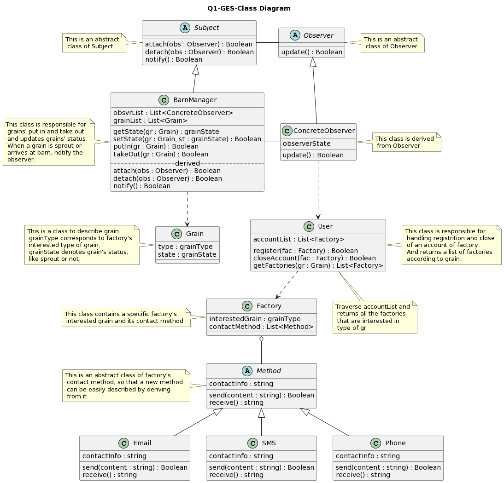
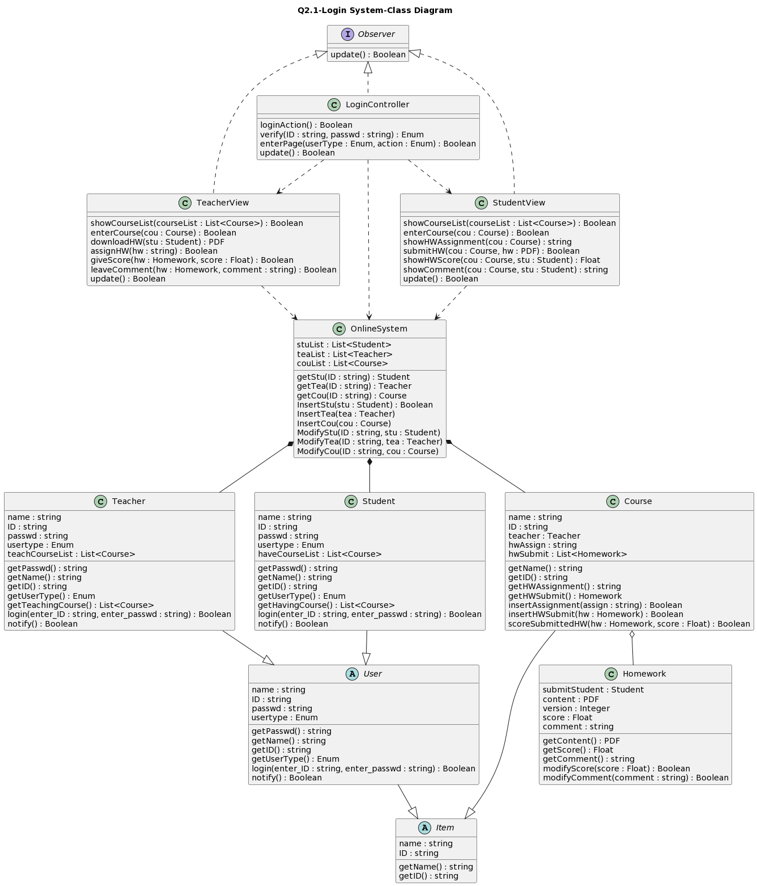
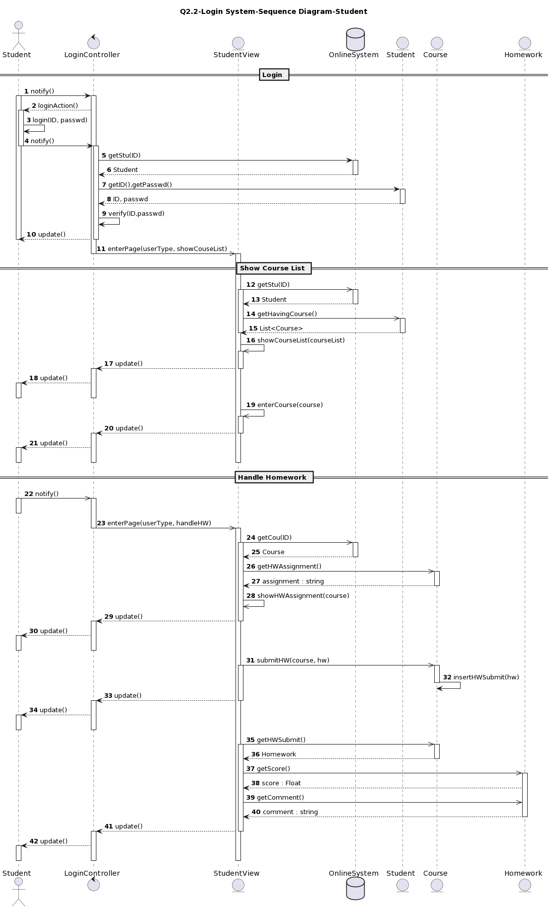
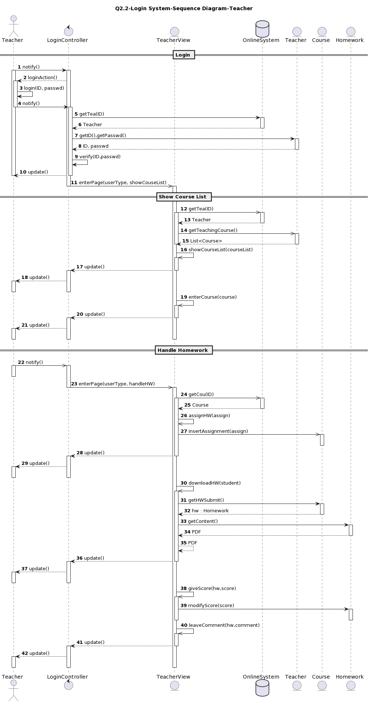

# Q1 智能仓储GES系统
## 1 解决方案-类图

## 2 具体描述
* 使用观察者模式，`Subject`和`Observer`都是抽象类，`BarnManager`和`ConcreteObserver`继承它们并具体化，`BarnManager`若有元素更新（如谷物的状态更新），会用`notify()`方法通知`ConcreteObserver`
* `Grain`：包含谷物类型`type`（包含加工厂感兴趣的各种类型）和状态`state`（如是否发芽，是否刚到达仓库等）
* `BarnManager`：仓库管理模块，存储了观察者列表和谷物列表，可以读取/修改谷物的状态、进行入仓或出仓
* `Method`：抽象的通信方式，包含通信信息域`contactInfo`和收发消息的方法`send(), receive()`
* `Email, SMS, Phone`：继承`Method`，是具体的通信方式，`contactInfo`域填入具体的通信信息，如邮箱地址、电话号码等。因为是继承于抽象的通信方式，当有新的通信方式出现时，模型可以很方便地进行扩展，以支持新的方式
* `Factory`：工厂，包含感兴趣的谷物类型`interestedGrain`和一个通信方式的列表`contactMethod`，观察者可根据`contactMethod`通知已注册的工厂
* `User`：用于为加工厂进行用户注册和注销，维护一个已注册的加工厂列表
---
# Q2 线上教育系统
## 1 解决方案-类图

## 2 具体描述
* 使用MVC模式（Model，View，Controller），`LoginController`是`Controller`，处理和用户的交互；`TeacherView`和`StudentView`是`View`，负责展示界面；`OnlineSystem`及其组成部分`Teacher`、`Student`、`Course`等是`Model`，存储具体的数据并对数据进行处理
* `Item`：抽象类。有名字域`name`和唯一标识的`ID`域，并能通过`getName()`和`getID()`方法获取
* `User`：继承于`Item`的抽象类。新增了密码`passwd`和用户类型`usertype`，用户类型是`enum`变量，包含：学生，老师，访客，非法用户等。用户通过`login()`方法，输入用户ID和密码进行登录；`notify()`方法负责将用户的行为通知观察者
* `Teacher`：继承于`User`的具体用户，表示教师。新增`teachCourseList`表示教师所教课程的列表，并通过`getTeachingCourse()`方法返回
* `Student`：继承于`User`的具体用户，表示学生。新增`haveCourseList`表示选课列表，并通过`getHavingCourse()`方法返回
* `Course`：继承于`Item`的具体类，表示课程。记录授课老师`teacher`、该课程的作业`hwAssign`和学生们上传的作业列表`hwSubmit`；学生通过`getHWAssignment()`方法可查看布置的作业、通过`insertHWSubmit()`方法可上传作业；教师通过`getHWSubmit()`方法可查看上传的作业、通过`insertAssignment()`方法可布置新作业、通过`scoreSubmittedHW()`方法可为已上传的作业评分
* `Homework`：课程的组成部分，表示作业。记录提交该作业的学生`submitStudent`、PDF格式的内容`content`、提交版本`version`、该作业得到的分数`score`和评价`comment`；通过`getContent()`、`getScore()`、`getComment()`可得到作业的内容、分数和评价；通过`modifyScore()`和`modifyComment()`可对作业进行评分和评价
* `OnlineSystem`：相当于一个数据库，维护学生列表`stuList`、教师列表`teaList`和课程列表`couList`。`getStu()`、`getTea()`和`getCou()`通过输入的ID在对应的列表里查找，并返回完整的元素。`InsertStu()`、`InsertTea()`和`InsertCou()`可更新列表，注册新用户或课程。`ModifyStu()`、`ModifyTea()`和`ModifyCou()`可对列表里的元素进行修改
* `TeacherView`，`StudentView`：负责视图的观察者，可以显示教师所授课程和学生所选课程、选择具体课程并进入页面；教师可布置作业、下载学生提交的作业、对学生的作业评分和给出评价；学生可查看布置的作业、上传作业、查看作业所得的分数和评价
* `LoginController`：负责登录和控制的观察者，根据用户登录时输入的密码和ID查找用户列表，确定用户类型，并选择具体的视图；当视图更新时，对用户进行更新、反馈
## 3 时序图-学生部分
**因为时序图太长了，所以把学生和老师的部分分开展示**

## 4 时序图-教师部分


# 附录-源码
## Q1 Class Diagram
```UML
@startuml
title Q1-GES-Class Diagram
@enduml


@startuml
abstract class Observer {
update() : Boolean
}
note right of Observer : This is an abstract\n class of Observer
class ConcreteObserver {
observerState
update() : Boolean
}
note right of ConcreteObserver : This class is derived\n from Observer
abstract class Subject {
attach(obs : Observer) : Boolean
detach(obs : Observer) : Boolean
notify() : Boolean
}
note left of Subject : This is an abstract\n class of Subject
class BarnManager {
obsvrList : List<ConcreteObserver>
grainList : List<Grain>
--
getState(gr : Grain) : grainState
setState(gr : Grain, st : grainState) : Boolean
putIn(gr : Grain) : Boolean
takeOut(gr : Grain) : Boolean
.. derived ..
attach(obs : Observer) : Boolean
detach(obs : Observer) : Boolean
notify() : Boolean
}
note left of BarnManager : This class is responsible for\n grains' put in and take out\n and updates grains' status.\n When a grain is sprout or\n arrives at barn, notify the\n observer.
Subject <|-- BarnManager
Observer <|-- ConcreteObserver
Subject - Observer
BarnManager - ConcreteObserver
BarnManager ..> Grain
ConcreteObserver ..> User
@enduml


@startuml
class Factory {
interestedGrain : grainType
contactMethod : List<Method>
}
note left of Factory : This class contains a specific factory's\n interested grain and its contact method
abstract class Method {
contactInfo : string
send(content : string) : Boolean
receive() : string
}
note left of Method : This is an abstract class of factory's\n contact method, so that a new method\n can be easily described by deriving\n from it.
class Email {
contactInfo : string
send(content : string) : Boolean
receive() : string
}
class SMS {
contactInfo : string
send(content : string) : Boolean
receive() : string
}
class Phone {
contactInfo : string
send(content : string) : Boolean
receive() : string
}
Factory o-- Method
Method <|-- Email
Method <|-- SMS
Method <|-- Phone
@enduml


@startuml
class User {
accountList : List<Factory>
register(fac : Factory) : Boolean
closeAccount(fac : Factory) : Boolean
getFactories(gr : Grain) : List<Factory>
}
note right of User : This class is responsible for\n handling registrition and close\n of an account of factory.\n And returns a list of factories\n according to grain.
note "Traverse accountList and\n returns all the factories\n that are interested in\n type of gr" as N_getFac
User -- N_getFac
User ..> Factory
@enduml


@startuml
class Grain {
type : grainType
state : grainState
}
note left of Grain : This is a class to describe grain.\n grainType corresponds to factory's\n interested type of grain.\n grainState denotes grain's status,\n like sprout or not.
@enduml
```
## Q2-1 Class Diagram
```UML
@startuml
title Q2.1-Login System-Class Diagram
@enduml


@startuml
interface Observer {
update() : Boolean
}

class LoginController {
loginAction() : Boolean
verify(ID : string, passwd : string) : Enum
enterPage(userType : Enum, action : Enum) : Boolean
update() : Boolean
}

Observer <|.. LoginController
@enduml


@startuml
class TeacherView {
showCourseList(courseList : List<Course>) : Boolean
enterCourse(cou : Course) : Boolean
downloadHW(stu : Student) : PDF
assignHW(hw : string) : Boolean
giveScore(hw : Homework, score : Float) : Boolean
leaveComment(hw : Homework, comment : string) : Boolean
update() : Boolean
}

class StudentView {
showCourseList(courseList : List<Course>) : Boolean
enterCourse(cou : Course) : Boolean
showHWAssignment(cou : Course) : string
submitHW(cou : Course, hw : PDF) : Boolean
showHWScore(cou : Course, stu : Student) : Float
showComment(cou : Course, stu : Student) : string
update() : Boolean
}

Observer <|.. TeacherView
Observer <|.. StudentView
LoginController ..> TeacherView
LoginController ..> StudentView
@enduml


@startuml
abstract class Item {
name : string
ID : string
getName() : string
getID() : string
}

abstract class User {
name : string
ID : string
passwd : string
usertype : Enum
getPasswd() : string
getName() : string
getID() : string
getUserType() : Enum
login(enter_ID : string, enter_passwd : string) : Boolean
notify() : Boolean
}
User --|> Item

class Teacher {
name : string
ID : string
passwd : string
usertype : Enum
teachCourseList : List<Course>
getPasswd() : string
getName() : string
getID() : string
getUserType() : Enum
getTeachingCourse() : List<Course>
login(enter_ID : string, enter_passwd : string) : Boolean
notify() : Boolean
}
Teacher --|> User

class Student {
name : string
ID : string
passwd : string
usertype : Enum
haveCourseList : List<Course>
getPasswd() : string
getName() : string
getID() : string
getUserType() : Enum
getHavingCourse() : List<Course>
login(enter_ID : string, enter_passwd : string) : Boolean
notify() : Boolean
}
Student --|> User

class Course {
name : string
ID : string
teacher : Teacher
hwAssign : string
hwSubmit : List<Homework>
getName() : string
getID() : string
getHWAssignment() : string
getHWSubmit() : Homework
insertAssignment(assign : string) : Boolean
insertHWSubmit(hw : Homework) : Boolean
scoreSubmittedHW(hw : Homework, score : Float) : Boolean
}
Course --|> Item

class Homework {
submitStudent : Student
content : PDF
version : Integer
score : Float
comment : string
getContent() : PDF
getScore() : Float
getComment() : string
modifyScore(score : Float) : Boolean
modifyComment(comment : string) : Boolean
}
Course o-- Homework
@enduml


@startuml
class OnlineSystem {
stuList : List<Student>
teaList : List<Teacher>
couList : List<Course>
getStu(ID : string) : Student
getTea(ID : string) : Teacher
getCou(ID : string) : Course
InsertStu(stu : Student) : Boolean
InsertTea(tea : Teacher)
InsertCou(cou : Course)
ModifyStu(ID : string, stu : Student)
ModifyTea(ID : string, tea : Teacher)
ModifyCou(ID : string, cou : Course)
}
OnlineSystem *-- Student
OnlineSystem *-- Teacher
OnlineSystem *-- Course
LoginController ..> OnlineSystem
TeacherView ..> OnlineSystem
StudentView ..> OnlineSystem
@enduml
```
## Q2-2.1 Sequence Diagram-Student
```UML
@startuml
title Q2.2-Login System-Sequence Diagram-Student
autonumber
@enduml


@startuml
actor Student as astu
control LoginController as c1
entity StudentView as svi
database OnlineSystem as sys
entity Student as stu
entity Course as cou
entity Homework as hw

== Login ==
astu -> c1 : notify()
activate astu
activate c1

c1 --> astu : loginAction()
activate astu
astu -> astu : login(ID, passwd)
astu -> c1 : notify()
deactivate astu

activate c1
c1 -> sys : getStu(ID)
activate sys
sys --> c1 : Student
deactivate sys

c1 -> stu : getID(),getPasswd()
activate stu
stu --> c1 : ID, passwd
deactivate stu

c1 -> c1 : verify(ID,passwd)
c1 --> astu : update()
deactivate c1
deactivate astu

c1 ->> svi : enterPage(userType, showCouseList)
deactivate c1
activate svi
@enduml

@startuml
== Show Course List ==
svi ->> sys : getStu(ID)
activate svi
activate sys
sys --> svi : Student
deactivate sys

svi ->> stu : getHavingCourse()
activate stu
stu --> svi : List<Course>
deactivate stu
deactivate svi

svi ->> svi : showCourseList(courseList)
activate svi
svi --> c1 : update()
deactivate svi
activate c1
c1 --> astu : update()
activate astu
deactivate astu
deactivate c1

svi ->> svi : enterCourse(course)
activate svi
svi --> c1 : update()
deactivate svi
activate c1
c1 --> astu : update()
activate astu
deactivate astu
deactivate c1
deactivate svi
@enduml


@startuml
== Handle Homework ==
astu ->> c1 : notify()
activate astu
deactivate astu
activate c1
c1 ->> svi : enterPage(userType, handleHW)
deactivate c1

activate svi
svi ->> sys : getCou(ID)
activate svi
activate sys
sys --> svi : Course
deactivate sys

svi ->> cou : getHWAssignment()
activate cou
cou --> svi : assignment : string
deactivate cou

svi ->> svi : showHWAssignment(course)
svi --> c1 : update()
deactivate svi
activate c1
c1 --> astu : update()
activate astu
deactivate astu
deactivate c1

svi ->> cou : submitHW(course, hw)
activate svi
activate cou
cou -> cou : insertHWSubmit(hw)
deactivate cou
svi --> c1 : update()
deactivate svi
activate c1
c1 --> astu : update()
activate astu
deactivate astu
deactivate c1

svi ->> cou : getHWSubmit()
activate svi
activate cou
cou --> svi : Homework
deactivate cou
svi ->> hw : getScore()
activate hw
hw --> svi : score : Float
svi ->> hw : getComment()
hw --> svi : comment : string
deactivate hw

svi --> c1 : update()
deactivate svi
activate c1
c1 --> astu : update()
activate astu
deactivate astu
deactivate c1
deactivate svi
@enduml

```
## Q2-2.2 Sequence Diagram-Teacher
```UML
@startuml
title Q2.2-Login System-Sequence Diagram-Teacher
autonumber
@enduml


@startuml
actor Teacher as atea
control LoginController as c2
entity TeacherView as tvi
database OnlineSystem as sys
entity Teacher as tea
entity Course as cou
entity Homework as hw

== Login ==
atea -> c2 : notify()
activate atea
activate c2

c2 --> atea : loginAction()
activate atea
atea -> atea : login(ID, passwd)
atea -> c2 : notify()
deactivate atea

activate c2
c2 -> sys : getTea(ID)
activate sys
sys --> c2 : Teacher
deactivate sys

c2 -> tea : getID(),getPasswd()
activate tea
tea --> c2 : ID, passwd
deactivate tea

c2 -> c2 : verify(ID,passwd)
c2 --> atea : update()
deactivate c2
deactivate atea

c2 ->> tvi : enterPage(userType, showCouseList)
deactivate c2
activate tvi
@enduml

@startuml
== Show Course List ==
tvi ->> sys : getTea(ID)
activate tvi
activate sys
sys --> tvi : Teacher
deactivate sys

tvi ->> tea : getTeachingCourse()
activate tea
tea --> tvi : List<Course>
deactivate tea
deactivate tvi

tvi ->> tvi : showCourseList(courseList)
activate tvi
tvi --> c2 : update()
deactivate tvi
activate c2
c2 --> atea : update()
activate atea
deactivate atea
deactivate c2

tvi ->> tvi : enterCourse(course)
activate tvi
tvi --> c2 : update()
deactivate tvi
activate c2
c2 --> atea : update()
activate atea
deactivate atea
deactivate c2
deactivate tvi
@enduml


@startuml
== Handle Homework ==
atea ->> c2 : notify()
activate atea
deactivate atea
activate c2
c2 ->> tvi : enterPage(userType, handleHW)
deactivate c2

activate tvi
tvi ->> sys : getCou(ID)
activate tvi
activate sys
sys --> tvi : Course
deactivate sys

tvi ->> tvi : assignHW(assign)
tvi ->> cou : insertAssignment(assign)
activate cou
deactivate cou
tvi --> c2 : update()
deactivate tvi
activate c2
c2 --> atea : update()
activate atea
deactivate atea
deactivate c2

tvi ->> tvi : downloadHW(student)
activate tvi
tvi -> cou : getHWSubmit()
activate cou
cou --> tvi : hw : Homework
deactivate cou
tvi -> hw : getContent()
activate hw
hw --> tvi : PDF
deactivate hw
tvi --> tvi : PDF
tvi --> c2 : update()
deactivate tvi
activate c2
c2 --> atea : update()
activate atea
deactivate atea
deactivate c2

tvi ->> tvi : giveScore(hw,score)
activate tvi
tvi -> hw : modifyScore(score)
activate hw
deactivate hw
deactivate tvi

tvi ->> tvi : leaveComment(hw,comment)
activate tvi
tvi --> c2 : update()
deactivate tvi
activate c2
c2 --> atea : update()
activate atea
deactivate atea
deactivate c2
deactivate tvi
@enduml

```